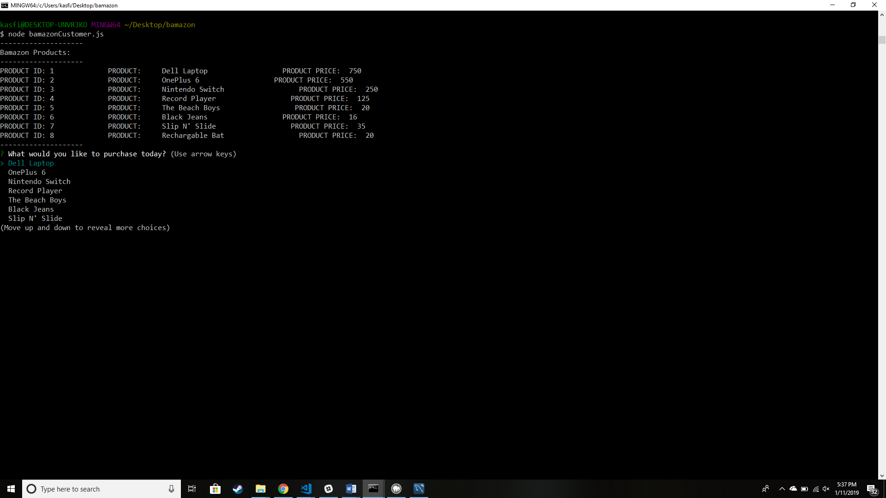
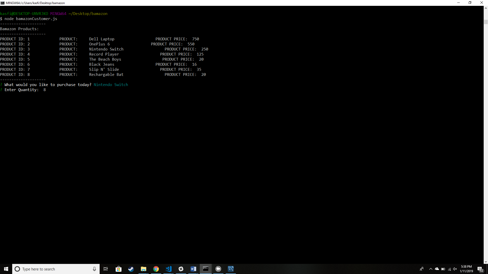
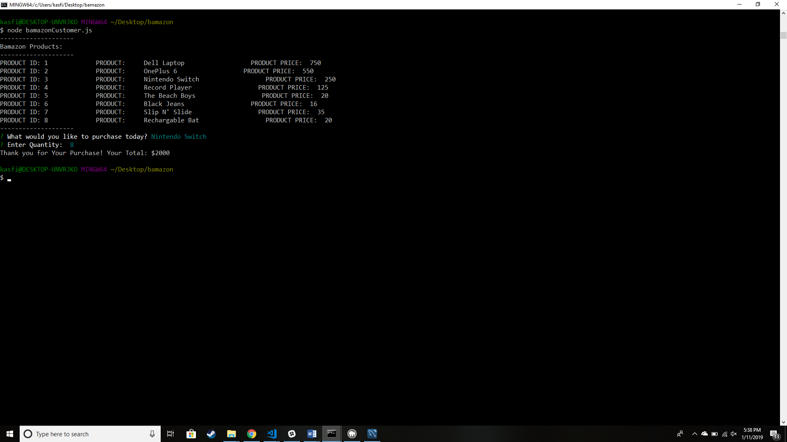

# Bamazon

>An Amazon-like CLI storefront built with mySQL, NODE.js and Inquirer NPM. Output styled with Colors and console.table NPM's. The app can take in orders from customers, calculate sales price and deplete stock from the store's inventory. Schema.sql and Seed.sql files have been included for database creation ranging in size from 15 to 100+ whimsical products.

### Deployment

1. Clone repo
2. Run `npm install`
3. Build database from `schema.sql` and `seeds_<15 or 100>.sql`
4. At command prompt run `node bamazonCustomer.js`

### Screenshot of this Project

### Technologies Utilized

* mySQL
* NodeJS
* JavaScript
* NPM Inquirer

